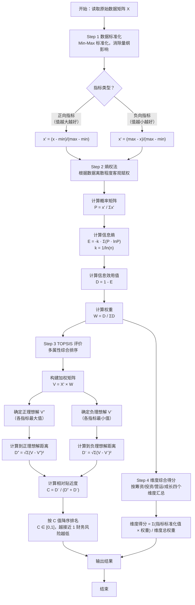

# 熵权法-TOPSIS 模型方法说明

---

## 1 数据标准化

由于各指标量纲和数量级存在差异，需先对原始数据进行标准化处理，消除量纲影响。

**正向指标**（值越大越好，如流动比率、毛利率等）：

$$x'_{ij} = \frac{x_{ij} - \min(x_j)}{\max(x_j) - \min(x_j)}$$

**负向指标**（值越小越好，如资产负债率）：

$$x'_{ij} = \frac{\max(x_j) - x_{ij}}{\max(x_j) - \min(x_j)}$$

其中，$x_{ij}$ 为第 $i$ 年，第 $j$ 个指标的原始值；$x'_{ij}$ 为标准化后的值，取值范围为 $[0, 1]$。

---

## 2 熵权法

熵权法是一种客观赋权方法，根据各指标数据的离散程度确定权重。指标数据分布越分散，熵值越小，权重越大。

### 2.1 计算概率矩阵

$$P_{ij} = \frac{x'_{ij}}{\sum_{i=1}^{n} x'_{ij}}$$

### 2.2 计算信息熵

$$E_j = -\frac{1}{\ln n} \sum_{i=1}^{n} P_{ij} \ln(P_{ij})$$

其中，$n$ 为样本年数。为避免 $\ln(0)$ 无定义，引入极小量 $\varepsilon = 10^{-10}$，计算时使用 $P_{ij} + \varepsilon$。

### 2.3 计算权重

首先计算各指标的信息效用值：

$$D_j = 1 - E_j$$

信息效用值越大，表明该指标的信息量越大，对评价结果的影响越显著。

权重计算公式：

$$W_j = \frac{D_j}{\sum_{j=1}^{m} D_j}$$

其中，$m$ 为指标数量，$\sum W_j = 1$。

---

## 3 TOPSIS 评价

TOPSIS 法通过计算各评价对象与正理想解和负理想解的距离来进行综合排序。

### 3.1 构建加权矩阵

$$V_{ij} = x'_{ij} \times W_j$$

### 3.2 确定正理想解与负理想解

正理想解（最优值）：

$$V_j^+ = \max(V_{ij})$$

负理想解（最差值）：

$$V_j^- = \min(V_{ij})$$

### 3.3 计算欧氏距离

各年份与正理想解的距离：

$$D_i^+ = \sqrt{\sum_{j=1}^{m} (V_{ij} - V_j^+)^2}$$

各年份与负理想解的距离：

$$D_i^- = \sqrt{\sum_{j=1}^{m} (V_{ij} - V_j^-)^2}$$

### 3.4 计算相对贴近度

$$C_i = \frac{D_i^-}{D_i^+ + D_i^-}$$

相对贴近度 $C_i \in [0, 1]$，值越接近 1，表明该年份财务状况越接近理想状态，财务风险越低；值越接近 0，表明财务风险越高。

---

## 4 维度综合得分

为便于分析各维度对整体财务风险的贡献，将指标按业务含义划分为四个维度，分别计算各维度的综合得分：

$$\text{维度得分} = \frac{\sum(\text{该维度内各指标标准化值} \times \text{对应权重})}{\text{该维度总权重}}$$

维度得分 $\in [0, 1]$，得分越高表示该维度表现越好，风险越低。
